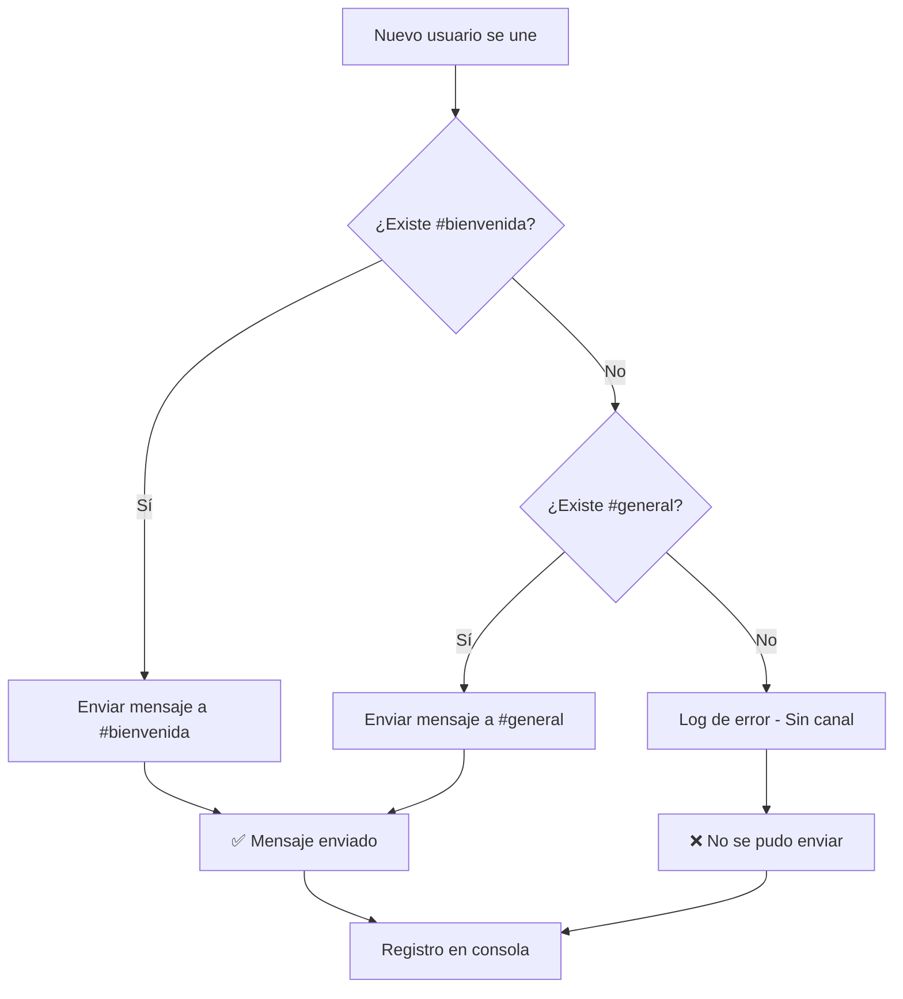

# 📋 Registro de Cambios - Bot Educativo Discord

## 🆕 Versión 1.1.0 - Bienvenida Automática (Agosto 2025)

### ✨ Nuevas Características

#### 👋 **Sistema de Bienvenida Automática**
- **Detección automática** de nuevos miembros del servidor
- **Búsqueda inteligente** de canales (`#bienvenida` → `#general`)
- **Mensaje completo** con toda la información necesaria para empezar

#### 📝 **Mensaje de Bienvenida Mejorado**
- Saludo personalizado mencionando al nuevo usuario
- Lista completa de comandos disponibles organizados por categoría
- Consejos prácticos para comenzar a usar el bot
- Formato atractivo con emojis y estructura clara

### 🔧 **Cambios Técnicos**

#### `BotEducativo.java`
```java
// Nuevo intent para detectar miembros
.enableIntents(GatewayIntent.MESSAGE_CONTENT, GatewayIntent.GUILD_MEMBERS)

// Nuevo método de evento
@Override
public void onGuildMemberJoin(GuildMemberJoinEvent event) {
    // Lógica de bienvenida automática
}
```

#### `ComandoBienvenida.java`
```java
// Nuevo método público
public String crearMensajeBienvenidaCompleto(String usuarioId) {
    // Genera mensaje completo con todos los comandos
}
```

### 📚 **Estructura del Mensaje Automático**

1. **🎉 Saludo de Bienvenida**
   - Menciona al usuario específico
   - Contexto sobre el propósito educativo

2. **📖 Comandos de Materias**
   - `!materia crear`, `listar`, `tareas`, `eliminar`

3. **📝 Comandos de Tareas**
   - `!tarea crear`, `listar`, `completar`

4. **🏆 Sistema de Progreso**
   - `!puntos` personal y para otros usuarios

5. **❓ Sistema de Ayuda**
   - `!ayuda` general y específica

6. **💡 Consejos Iniciales**
   - Pasos sugeridos para empezar
   - Ejemplos prácticos de comandos

### 🎯 **Configuración Requerida**

#### **Permisos del Bot en Discord**
- ✅ `Send Messages` (ya configurado)
- ✅ `Read Message History` (ya configurado) 
- ✅ **`View Server Members`** (NUEVO - requerido)

#### **Canales Recomendados**
- `#bienvenida` - Canal preferido para mensajes automáticos
- `#general` - Canal de respaldo si no existe `#bienvenida`

### 🔄 **Flujo de Funcionamiento**



### 🎓 **Valor Educativo Añadido**

#### **Conceptos POO Demostrados**
- **Eventos y Listeners**: Manejo de `GuildMemberJoinEvent`
- **Polimorfismo**: Sobrescritura de `onGuildMemberJoin()`
- **Encapsulamiento**: Método `crearMensajeBienvenidaCompleto()` 
- **Separación de Responsabilidades**: Lógica en clase específica

#### **Patrones de Diseño**
- **Observer Pattern**: Escucha eventos de Discord
- **Template Method**: Estructura consistente de mensajes
- **Strategy Pattern**: Búsqueda de canal con fallback

### 📊 **Métricas de Mejora**

- **+40 líneas** de código funcional
- **+1 método público** para reutilización
- **+1 evento manejado** (bienvenida automática)
- **100% compatibilidad** con código existente

### 🚀 **Instalación y Uso**

1. **Compilar con cambios**:
   ```bash
   mvn clean package
   ```

2. **Configurar permisos**:
   - Asegurar que el bot tenga permiso `View Server Members`
   - Crear canal `#bienvenida` (opcional pero recomendado)

3. **Ejecutar**:
   ```bash
   java -jar target/discord-bot-educativo-1.0.0.jar
   ```

4. **Probar**:
   - Invitar un usuario de prueba al servidor
   - Verificar que aparezca el mensaje automático
   - Comprobar el log en consola

### 🏆 **Beneficios para Usuarios**

#### **👨‍🎓 Para Estudiantes**
- **Orientación inmediata** al unirse al servidor
- **Lista completa** de herramientas disponibles
- **Ejemplos prácticos** para comenzar rápidamente

#### **👩‍🏫 Para Profesores** 
- **Reducción de preguntas** frecuentes sobre comandos
- **Onboarding automático** de nuevos estudiantes
- **Experiencia profesional** similar a sistemas reales

#### **💻 Para Desarrolladores**
- **Demostración práctica** de manejo de eventos
- **Código limpio** y bien documentado
- **Extensibilidad** para nuevas funcionalidades automáticas

---

## 📝 Versión 1.0.0 - Lanzamiento Inicial

### ✨ Características Iniciales
- Sistema completo de gestión de materias
- Gestión de tareas con puntuación
- Sistema de progreso gamificado
- Comandos de ayuda contextual
- Persistencia en memoria
- Arquitectura POO completa

---

**🎉 ¡El bot ahora da la bienvenida automáticamente a todos los nuevos usuarios!**
