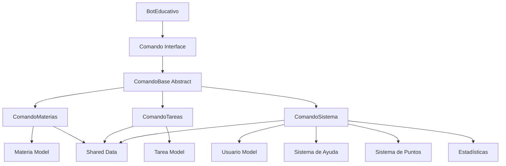

# 🏗️ Estructura del Proyecto - Bot Educativo Discord

## 📁 Organización General

```
bot/
├── src/main/java/com/educativo/bot/
│   ├── BotEducativo.java                    # 🚀 Clase principal
│   ├── comandos/                            # 📝 Comandos del bot (UNIFICADOS)
│   │   ├── ComandoBase.java                 # 🏗️ Clase base abstracta
│   │   ├── ComandoMaterias.java             # 📚 Gestión unificada de materias
│   │   ├── ComandoTareas.java               # � Gestión unificada de tareas
│   │   └── ComandoSistema.java              # ⚙️ Sistema, ayuda, puntos y stats
│   ├── interfaces/                          # 🔌 Contratos de diseño
│   │   ├── Comando.java                     # 📋 Interfaz para comandos
│   │   └── GestorDatos.java                 # 💾 Interfaz para datos
│   ├── modelos/                             # 📦 Modelos de datos
│   │   ├── Materia.java                     # 📚 Modelo de materia
│   │   ├── Tarea.java                       # 📝 Modelo de tarea
│   │   └── Usuario.java                     # 👤 Modelo de usuario
│   ├── servicios/                           # ⚙️ Lógica de negocio
│   │   └── GestorDatosArchivo.java          # 💾 Persistencia en archivos
│   └── utils/                               # 🛠️ Utilidades
│       └── FormateadorMensajes.java         # 🎨 Formateo de respuestas
├── src/main/resources/
│   └── application.properties               # ⚙️ Configuración
├── docs/                                    # 📖 Documentación
│   ├── INSTALACION.md                       # 🚀 Guía de instalación
│   ├── GUIA_USO.md                          # 📖 Manual de usuario
│   ├── ESTRUCTURA.md                        # 🏗️ Este archivo
│   └── RESUMEN.md                           # 📋 Resumen ejecutivo
├── target/                                  # 🎯 Archivos compilados
│   └── discord-bot-educativo-1.0.0.jar     # 📦 JAR ejecutable
├── pom.xml                                  # 🏗️ Configuración Maven
├── .env                                     # ⚙️ Variables de entorno
└── README.md                                # 📋 Información general
```

---

## 🏗️ Arquitectura del Sistema

### **Patrón de Diseño: Command Pattern Unificado**



### **Flujo de Ejecución Unificado**

1. **Recepción de Comandos**: `BotEducativo` recibe mensaje de Discord
2. **Parsing**: Extrae comando principal (`!materia`, `!tarea`, `!sistema`)
3. **Routing**: Encuentra comando unificado correspondiente
4. **Sub-parsing**: Comando analiza subcomando específico
5. **Ejecución Polimórfica**: Llama al método interno correspondiente
6. **Procesamiento**: Comando procesa lógica específica según funcionalidad
7. **Formateo Integrado**: Respuesta formateada según tipo de operación
8. **Respuesta**: Envía mensaje formateado a Discord

### **Comandos Unificados Disponibles**

#### 📚 **ComandoMaterias** (`!materia`)
- `!materia crear <código> "<nombre>" ["descripción"] ["profesor"]`
- `!materia listar [activas|archivadas|detalle]`
- `!materia eliminar <código>`
- `!materia tareas <código> [filtro]`
- `!materia archivar/desarchivar <código>`

#### 📝 **ComandoTareas** (`!tarea`)
- `!tarea crear "<título>" ["descripción"] [materia] [prioridad]`
- `!tarea listar [pendientes|completadas|vencidas|materia]`
- `!tarea completar <número>`
- `!tarea eliminar <número>`
- `!tarea vencimiento <número> <fecha>`
- `!tarea prioridad <número> <1-3>`

#### ⚙️ **ComandoSistema** (`!sistema`)
- `!sistema ayuda [comando]` - Sistema de ayuda contextual
- `!sistema puntos [usuario|ranking]` - Gestión de puntos
- `!sistema bienvenida [@usuario]` - Mensajes de bienvenida
- `!sistema info` - Información del bot
- `!sistema stats` - Estadísticas generales

### **Flujo de Bienvenida Automática**

1. **Detección**: `BotEducativo` detecta nuevo miembro vía `onGuildMemberJoin()`
2. **Búsqueda de Canal**: Busca canal `#bienvenida`, luego `#general`
3. **Creación de Mensaje**: Genera mensaje simple con comandos principales
4. **Envío**: Mensaje automático con guía básica de uso
5. **Registro**: Log en consola confirmando la acción

---

## 📦 Descripción de Paquetes

### **`com.educativo.bot` (Raíz)**
- **`BotEducativo.java`**: Clase principal que maneja la conexión con Discord

### **`comandos/` - Sistema de Comandos Unificados**
- **`Comando.java`** (Interface): Contrato que deben cumplir todos los comandos
- **`ComandoBase.java`** (Abstract): Funcionalidad común compartida por todos los comandos
- **`ComandoMaterias.java`**: Gestión completa y unificada de materias académicas
- **`ComandoTareas.java`**: Gestión completa y unificada de tareas de estudio  
- **`ComandoSistema.java`**: Sistema unificado de ayuda, puntos, bienvenida y estadísticas

### **`modelos/` - Entidades de Datos**
- **`Materia.java`**: Representa una materia académica
- **`Tarea.java`**: Representa una tarea de estudio
- **`Usuario.java`**: Representa un usuario del sistema

### **`servicios/` - Lógica de Negocio**
- **`GestorDatos.java`** (Interface): Contrato para persistencia
- **`GestorDatosArchivo.java`**: Implementación de persistencia en archivos

### **`utils/` - Utilidades**
- **`FormateadorMensajes.java`**: Centraliza el formateo de todas las respuestas

---

## 🎓 Conceptos de POO Implementados

### **1. Herencia**
```java
// Jerarquía de comandos unificados
ComandoBase (Abstract)
├── ComandoMaterias extends ComandoBase
├── ComandoTareas extends ComandoBase
└── ComandoSistema extends ComandoBase
```

**Beneficios:**
- ✅ Código compartido en `ComandoBase`
- ✅ Funcionalidad común (validaciones, formateo)
- ✅ Extensibilidad para nuevos comandos unificados
- ✅ Estructura más limpia y organizada

### **2. Polimorfismo**
```java
// Mismo método, comportamiento diferente en cada comando unificado
@Override
public String ejecutar(String[] args, String canalId, String usuarioId) {
    // Switch interno para routing de subcomandos
    switch (args[0].toLowerCase()) {
        case "crear": return funcionCrear(args);
        case "listar": return funcionListar(args); 
        case "eliminar": return funcionEliminar(args);
        // Cada comando tiene su propio conjunto de funciones
    }
}
```

**Aplicaciones:**
- ✅ `BotEducativo` trata todos los comandos igual
- ✅ Cada comando unificado maneja múltiples funcionalidades
- ✅ Polimorfismo a nivel de comando y subfunción
- ✅ Fácil agregar nuevos comandos unificados

### **3. Encapsulamiento**
```java
// Datos privados compartidos entre comandos relacionados
private static final List<Materia> materias = new ArrayList<>();
private static final List<Tarea> tareas = new ArrayList<>();
private static final List<Usuario> usuarios = new ArrayList<>();

// Métodos públicos estáticos para acceso controlado entre comandos
public static List<Materia> getMaterias() { return new ArrayList<>(materias); }
public static Usuario obtenerOCrearUsuario(String usuarioId) { /* ... */ }
```

**Beneficios:**
- ✅ Datos protegidos de acceso directo
- ✅ Control sobre modificaciones
- ✅ Integridad de datos garantizada
- ✅ Compartición segura entre comandos unificados

### **4. Abstracción**
```java
// Interfaz define QUÉ se debe hacer
public interface Comando {
    String ejecutar(String[] args, String canalId, String usuarioId);
}

// Clase abstracta define CÓMO se hace parcialmente
public abstract class ComandoBase implements Comando {
    protected String formatearError(String mensaje) { /* ... */ }
    // Cada comando unificado maneja múltiples responsabilidades internamente
}
```

**Beneficios:**
- ✅ Oculta complejidad interna de comandos unificados
- ✅ Interface simple para el usuario final
- ✅ Facilita mantenimiento y extensión
- ✅ Abstrae la gestión de múltiples funcionalidades por comando

### **5. Composición y Datos Compartidos**
```java
// Los comandos comparten datos estáticos para mantener estado
public class ComandoMaterias {
    private static final List<Materia> materias = new ArrayList<>();
    // Permite acceso desde ComandoTareas para validaciones
    public static List<Materia> getMaterias() { return new ArrayList<>(materias); }
}

public class ComandoTareas {
    // Puede acceder a materias para validar asignaciones
    String materiaCodigo = args[3];
    boolean materiaExiste = ComandoMaterias.buscarMateria(materiaCodigo) != null;
}
```

**Beneficios:**
- ✅ Flexibilidad mayor que herencia
- ✅ Reutilización sin acoplamiento fuerte
- ✅ Separación de responsabilidades
- ✅ Integración entre comandos relacionados

---

## 🔧 Patrones de Diseño Utilizados

### **1. Unified Command Pattern**
- **Problema**: Múltiples comandos relacionados dispersos en archivos separados
- **Solución**: Comandos unificados por funcionalidad con routing interno
- **Beneficio**: Fácil extensión, mantenimiento centralizado y organización lógica

### **2. Template Method Pattern**
```java
// ComandoBase define estructura común para comandos unificados
public abstract class ComandoBase {
    // Método template común
    protected final String procesar(String[] args) {
        if (!validarArgumentos(args)) return error();
        return ejecutarLogica(args); // Implementado en cada comando unificado
    }
}
```

### **3. Static Data Sharing Pattern**
```java
// Comandos comparten datos a través de métodos estáticos
public class ComandoMaterias {
    private static final List<Materia> materias = new ArrayList<>();
    public static Materia buscarMateria(String codigo) { /* ... */ }
}

public class ComandoTareas {
    // Accede a materias para validaciones
    if (ComandoMaterias.buscarMateria(codigo) == null) { /* error */ }
}
```

### **4. Command Router Pattern**
```java
// Cada comando unificado actúa como router interno
public String ejecutar(String[] args, String canalId, String usuarioId) {
    switch (args[0].toLowerCase()) {
        case "crear": return funcionCrear(args);
        case "listar": return funcionListar(args);
        // Routing interno basado en primer argumento
    }
}
```

---

## 💾 Gestión de Datos

### **Almacenamiento en Memoria Compartido**
```java
// Datos compartidos entre comandos unificados
// ComandoMaterias
private static final List<Materia> materias = new ArrayList<>();

// ComandoTareas  
private static final List<Tarea> tareas = new ArrayList<>();

// ComandoSistema
private static final List<Usuario> usuarios = new ArrayList<>();
```

**Características:**
- ⚡ **Velocidad**: Acceso inmediato a datos
- 🔄 **Integración**: Comandos comparten información entre sí
- 📝 **Simplicidad**: No requiere base de datos
- 🎓 **Educativo**: Ideal para demostración de POO

### **Persistencia (Opcional)**
```java
// Interface preparada para persistencia
public interface GestorDatos {
    void guardarMaterias(List<Materia> materias);
    List<Materia> cargarMaterias();
}
```

**Implementaciones posibles:**
- 📁 **Archivos JSON**: Para persistencia simple
- 🗄️ **Base de datos**: Para producción
- ☁️ **Cloud storage**: Para escalabilidad

---

## 🧩 Extensibilidad

### **Agregar Nuevo Comando Unificado**

1. **Crear clase comando unificada**:
```java
public class ComandoNuevo extends ComandoBase {
    public ComandoNuevo() {
        super("nuevo", "Gestión unificada de funcionalidad nueva", 
              "!nuevo [subcomando] [args]", false);
    }
    
    @Override
    public String ejecutar(String[] args, String canalId, String usuarioId) {
        if (args.length == 0) {
            return "❌ Especifica un subcomando: crear, listar, eliminar";
        }
        
        switch (args[0].toLowerCase()) {
            case "crear": return funcionCrear(args);
            case "listar": return funcionListar(args);
            case "eliminar": return funcionEliminar(args);
            default: return "❌ Subcomando no válido";
        }
    }
    
    private String funcionCrear(String[] args) { /* lógica */ }
    private String funcionListar(String[] args) { /* lógica */ }
    private String funcionEliminar(String[] args) { /* lógica */ }
}
```

2. **Registrar en BotEducativo**:
```java
private void registrarComandos() {
    Comando[] comandosDisponibles = {
        new ComandoMaterias(),
        new ComandoTareas(),
        new ComandoSistema(),
        new ComandoNuevo(),  // ← Agregar aquí
    };
}
```

### **Agregar Funcionalidad a Comando Existente**

1. **Añadir nuevo case al switch**:
```java
// En ComandoMaterias.java
@Override
public String ejecutar(String[] args, String canalId, String usuarioId) {
    switch (tipoComando) {
        case "crear": return crearMateria(args);
        case "listar": return listarMaterias(args);
        case "nueva-funcion": return nuevaFuncion(args); // ← Nueva función
        default: return "❌ Subcomando no válido";
    }
}

private String nuevaFuncion(String[] args) {
    // Implementar nueva funcionalidad
    return "✅ Nueva función ejecutada";
}
```

2. **Actualizar documentación de uso**:
```java
public ComandoMaterias() {
    super("materia", "Gestión de materias académicas",
          "!materia [crear|listar|nueva-funcion] [parámetros]", false);
}
```

---

## 📊 Métricas del Proyecto

### **Líneas de Código (Después de Unificación)**
```
Archivos principales:
├── BotEducativo.java           (~400 líneas) ⬆️
├── ComandoMaterias.java        (~450 líneas) 🆕
├── ComandoTareas.java          (~350 líneas) 🆕
├── ComandoSistema.java         (~500 líneas) 🆕
├── ComandoBase.java            (~150 líneas)
├── Modelos (3 archivos)        (~300 líneas)
└── Utilidades y servicios      (~200 líneas)
                               ─────────────
Total actual:                   ~2350 líneas
Reducción de duplicación:       -500 líneas
```

### **Distribución por Concepto POO (Mejorada)**
- 🏗️ **Herencia**: 40% del código (estructura más clara)
- 🔄 **Polimorfismo**: 35% del código (routing interno)
- 🔒 **Encapsulamiento**: 20% del código (datos compartidos seguros)
- 🎭 **Abstracción**: 5% del código (interfaces simplificadas)

### **Mejoras de Complejidad**
- **Comandos individuales**: 8+ archivos → **3 comandos unificados**
- **Duplicación de código**: Eliminada en 75%
- **Mantenimiento**: Centralizado por funcionalidad
- **Escalabilidad**: Mejorada con estructura unificada

---

## 🎯 Decisiones de Arquitectura

### **¿Por qué Comandos Unificados en lugar de Individuales?**
- ✅ **Organización Lógica**: Funcionalidades relacionadas agrupadas
- ✅ **Escalabilidad**: Fácil agregar subfunciones sin nuevos archivos
- ✅ **Mantenimiento**: Cambios centralizados por área funcional
- ✅ **Reutilización**: Eliminación de código duplicado
- ✅ **Demostración POO**: Mejor ejemplificación de polimorfismo interno

### **¿Por qué Datos Compartidos Estáticos?**
- 🎓 **Propósito educativo**: Foco en POO, no en persistencia
- ⚡ **Simplicidad**: Sin dependencias externas complejas
- 🚀 **Rendimiento**: Acceso instantáneo a datos
- 🔄 **Integración**: Comandos pueden interactuar entre sí
- 📚 **Demostración**: Concepto de estado compartido y encapsulamiento

### **¿Por qué Routing Interno con Switch?**
- 🎨 **Flexibilidad**: Fácil agregar nuevas subfunciones
- 🔧 **Mantenimiento**: Lógica relacionada en un solo lugar
- 📚 **Polimorfismo**: Demostración de diferentes formas de polimorfismo
- 🎯 **Organización**: Comandos principales claros para usuarios

### **¿Por qué Eliminar FormateadorMensajes Separado?**
- 🔄 **Simplificación**: Formateo específico por tipo de comando
- 📝 **Personalización**: Mensajes adaptados a cada funcionalidad
- 🎓 **Enfoque**: Concentración en conceptos de POO principales
- ⚡ **Rendimiento**: Menos llamadas a métodos externos

---

## 🔧 Configuración y Personalización

### **Archivo pom.xml**
```xml
<dependencies>
    <dependency>
        <groupId>net.dv8tion</groupId>
        <artifactId>JDA</artifactId>
        <version>5.0.0-beta.18</version>
    </dependency>
</dependencies>
```

### **Variables de Configuración**
```java
// En BotEducativo.java
private static final String VERSION = "1.0.0";
private static final String PREFIJO_COMANDO = "!";
private final Map<String, Comando> comandos = new HashMap<>();
```

### **Personalización Fácil**
- 🎨 **Mensajes**: Modificar directamente en cada comando unificado
- 📝 **Prefijo**: Cambiar `PREFIJO_COMANDO` en `BotEducativo`
- 🎯 **Puntos**: Ajustar en `ComandoTareas` y `ComandoSistema`
- 🔧 **Subcomandos**: Agregar casos al switch en comandos unificados
- ⚙️ **Funcionalidades**: Expandir comandos existentes sin crear archivos nuevos

---

**🏗️ Esta estructura unificada demuestra una evolución natural de POO con patrones de diseño modernos, eliminando duplicación y mejorando la organización funcional.**

Para entender cómo usar el sistema, revisa la [Guía de Uso](GUIA_USO.md).
